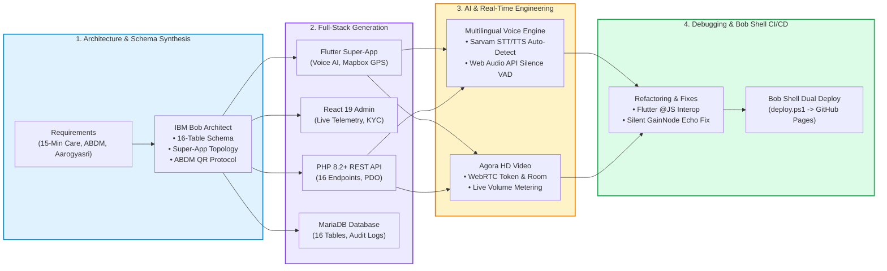

# How We Used IBM Bob to Implement HealthExpress AI

HealthExpress AI is an intelligent healthcare platform and operational control center architected, synthesized, debugged, and deployed end-to-end with **IBM Bob** as our primary AI software engineering development partner.

---

## 1. Executive Summary

IBM Bob functioned across every layer of the polyglot stack—from translating complex clinical and government healthcare compliance mandates into a normalized relational database schema, to generating Flutter mobile/web client architectures, React 19 administrative workspaces, secure PHP 8.2+ REST backend APIs, and real-time WebRTC audio/video systems.

---

## 2. Key Development Activities Powered by IBM Bob

### A. Architectural Modeling & Database Schema Synthesis
* **Clinical Mandate Mapping**: Analyzed Ayushman Bharat Digital Mission (ABDM) tokenized consent policies, Dr. YSR Aarogyasri cashless pre-authorizations, and 15-minute emergency dark-store logistics SLAs.
* **16-Table Relational MariaDB Schema**: Synthesized normalized database structures (`u170253497_healthexpress`) with primary/foreign key constraints, geolocation indexes, and immutable audit logs across users, doctors, hospitals, appointments, prescriptions, and pharmacy inventories.

### B. Polyglot Full-Stack Code Generation
* **Flutter Mobile & Web Super-App**: Generated state providers (Riverpod/Provider), responsive UI layouts, Mapbox GL vector map integrations, and multi-role routing.
* **React 19 Operations Command Center**: Structured 12 administrative command workspaces with live MariaDB telemetry, hospital bed capacity tracking (General, ICU, Trauma), dark-store drug license verification queues, and financial ledgers.
* **PHP 8.2+ Production REST Backend**: Generated 16 modular endpoints with PDO connection pooling, Apache `mod_rewrite` clean URL routing, parameterized SQL queries, and HMAC-SHA256 signature verification for Razorpay payments.

### C. Multimodal AI & Real-Time Telehealth Engineering
* **Multilingual Clinical Voice Intake**: Engineered the regional voice engine supporting Telugu, Hindi, English, Tanglish (*"naku jwaram undi"*), and Hinglish (*"mujhe bukhar hai"*). Prompts strictly enforce replies in the patient's language and trigger Sarvam regional HD voices (`kavitha`, `kavya`, `priya`).
* **Web Audio API RMS Voice Activity Detection (VAD)**: Synthesized client-side real-time audio energy analysis in `web/index.html` to detect voice pauses and auto-cut transmissions with zero manual button pressing.
* **Agora HD WebRTC Teleconsultation**: Integrated dynamic token generation, encrypted video streams, and live volume metering for doctor-patient calls.

### D. Codebase Refactoring, Debugging & Bob Shell Automation
* **Interop & Audio Echo Fixes**: Resolved complex Flutter Web `@JS` interop bindings and eliminated WebRTC audio feedback loops by injecting silent `GainNode` routing.
* **Automated Dual Deployment (`deploy.ps1`)**: Built PowerShell CI/CD automation compiling both Flutter Web and React Admin, simultaneously deploying production bundles to GitHub Pages.

---

## 3. Technology Stack Summary

| Layer | Framework / Technology | Role Generated via IBM Bob |
| :--- | :--- | :--- |
| **Mobile & Web Super-App** | Flutter 3.x (Dart) | Multilingual voice intake, Mapbox GPS, glassmorphism UI |
| **Operations Dashboard** | React 19 + Vite | 12 admin workspaces, bed capacity, KYC review queues |
| **Cloud REST Backend** | PHP 8.2+ (Hostinger) | 16 modular endpoints, PDO pooling, JWT security |
| **Relational Database** | MariaDB | 16 normalized tables, spatial indexes, audit logs |
| **Multimodal Voice AI** | Sarvam AI + NVIDIA NIM | `saaras:v3` STT, `bulbul:v3` TTS, `GPT-OSS-20B` SOAP triage |
| **Video Telehealth** | Agora RTC Engine | Sub-200ms WebRTC video, dynamic token authentication |
| **Geospatial Mapping** | Mapbox GL | Vector tiles, live rider GPS coordinates, hospital geofencing |
| **Payment Gateway** | Razorpay Live | UPI, Cards, NetBanking with HMAC-SHA256 verification |
