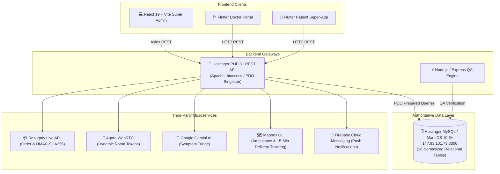
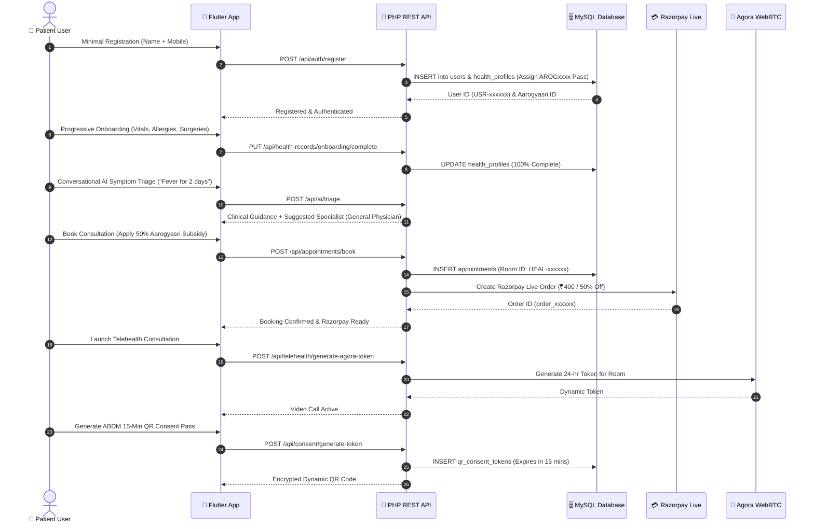

# 🏥 HealthExpress AI — Full-Stack Healthcare Super-App & Control Center

[](https://flutter.dev)
[](https://react.dev)
[](https://vitejs.dev)
[](https://www.php.net)
[](https://www.mysql.com)
[](https://razorpay.com)
[](https://www.agora.io)
[](https://deepmind.google/technologies/gemini/)

> **HealthExpress AI** is an end-to-end healthcare ecosystem combining an AI-powered Flutter patient/doctor super-app, a high-performance React 19 + Vite Super Admin Control Center, and a modular PHP 8+ REST API backend hosted on Hostinger connected directly to live MySQL.

---

## 📑 Table of Contents

- [1. System Architecture](#1-system-architecture)
- [2. Role-Wise Workflows & Diagrams](#2-role-wise-workflows--diagrams)
  - [A. Patient / User Journey](#a-patient--user-journey)
  - [B. Doctor Clinical Workspace](#b-doctor-clinical-workspace)
  - [C. Hospital Administration](#c-hospital-administration)
  - [D. Super Admin Operations](#d-super-admin-operations)
- [3. Technology Stack & Directory Structure](#3-technology-stack--directory-structure)
- [4. Relational Database Schema (16 Tables)](#4-relational-database-schema-16-tables)
- [5. API Endpoint Directory (28+ Endpoints)](#5-api-endpoint-directory-28-endpoints)
- [6. Setup & Installation](#6-setup--installation)
- [7. Hostinger PHP Production Deployment](#7-hostinger-php-production-deployment)
- [8. Automated QA Test Suite](#8-automated-qa-test-suite)

---

## 1. System Architecture



---

## 2. Role-Wise Workflows & Diagrams

### A. Patient / User Journey



---

### B. Doctor Clinical Workspace

```mermaid
flowchart TD
    D1[🩺 Doctor Login & Profile] --> D2{MCI Verification Status}
    D2 -->|Pending| D3[Upload Medical Registration & Degree Certs]
    D3 --> D4[Admin Reviews & Approves in Workspace]
    D2 -->|Verified| D5[Live Daily Queue & Patient Telemetry]
    
    D5 --> D6[In-Clinic / Video Appointments]
    D5 --> D7[Doctor Scans Patient ABDM QR Pass]
    
    D7 --> D8[API Validates 15-Min Token & Logs Audit Trail]
    D8 --> D9[Unlocks Patient Medical History & Surgeries]
    
    D6 --> D10[Issue Digital Prescription with Timed Dosages]
    D10 --> D11[Prescription Synced to Patient Aarogyasri Health Vault]
    D11 --> D12[Earnings & Payout Ledger Updated (80% Doctor Payout)]
```

---

### C. Hospital Administration

```mermaid
flowchart LR
    H1[🏥 Hospital Empanelment Wizard] --> H2[Step 1: Basic Facility Details & License]
    H2 --> H3[Step 2: 24/7 Hotline & Contact]
    H3 --> H4[Step 3: Mapbox Location & GPS Coordinates]
    H4 --> H5[Step 4: Emergency, ICU, Lab & Radiology Services]
    H5 --> H6[Step 5: Clinical Departments: Cardiology, Ortho, etc.]
    H6 --> H7[Step 6: Bed Capacity & OTs]
    H7 --> H8[Step 7: Medical Director Administration]
    H8 --> H9[Step 8: Review & Activate Facility in MySQL]
```



---

### D. Super Admin Operations

```mermaid
graph TD
    SA[👑 Super Admin Control Center] --> Ops[Operations Management]
    SA --> AICont[AI Engine & Content]
    SA --> SecSys[Security & Analytics]

    Ops --> M1[Dashboard - 8 Real-time KPI Metric Cards]
    Ops --> M2[Hospitals - Empaneled facilities & Bed hierarchy]
    Ops --> M3[Doctors - Credentialing checklist & status toggles]
    Ops --> M4[Users - Patient registry & Aarogyasri ID passes]
    Ops --> M5[Appointments - Central lifecycle tracker]
    Ops --> M6[Payments - Razorpay gross revenue & doctor payouts]
    Ops --> M7[Tickets - 2-column helpdesk resolution board]

    AICont --> M8[Visual Clinical AI Rule Builder]
    AICont --> M9[CMS & Outbreak Health Protocols]
    AICont --> M10[FCM Push & In-App Notification Broadcast]

    SecSys --> M11[Volume Curves & Daily Booking Trends]
    SecSys --> M12[Immutable ABDM & Clinical Audit Trails]
    SecSys --> M13[System Settings & Security Config]
```



---

## 3. Technology Stack & Directory Structure

```
healthyxpress_medha/
├── healthexpress/                # 📱 Flutter Mobile Super-App (Patient + Doctor)
│   ├── lib/
│   │   ├── core/theme/           # Design system tokens (Medical Blue #1E60F6)
│   │   ├── models/               # Hospital, Doctor, Medicine, Appointment models
│   │   ├── providers/            # State management (Auth, AI, Appointments)
│   │   ├── services/api_service.dart # HTTP REST client to PHP backend
│   │   └── screens/
│   │       ├── user/             # Dynamic AI Home, Booking, Pharmacy, Records, QR
│   │       └── doctor/           # Clinical queue, QR Scanner, Rx Creator, Earnings
│   └── pubspec.yaml
│
├── admin_panel/                  # 💻 React 19 + Vite Super Admin Control Center
│   ├── src/
│   │   ├── components/           # Sidebar (13 links), Header, Modals, MetricCards
│   │   ├── services/api.js       # Axios client fetching live SQL metrics
│   │   └── views/
│   │       ├── DashboardView.jsx # 8 KPI Cards, Revenue curve, Live activity feed
│   │       ├── HospitalsView.jsx # 8-step wizard & department drawer
│   │       ├── DoctorsView.jsx   # Credentialing verification workspace
│   │       ├── UsersView.jsx     # Patient registry & health pass
│   │       ├── AppointmentsView.jsx # Lifecycle timeline modal
│   │       ├── PaymentsView.jsx  # Financial ledger & Razorpay logs
│   │       ├── TicketsView.jsx   # Helpdesk resolution desk
│   │       ├── AiManagementView.jsx # Visual rule builder (IF symptom THEN specialty)
│   │       ├── NotificationsView.jsx # FCM notification composer
│   │       ├── ReportsView.jsx   # Volume rankings & trend charts
│   │       ├── AuditLogsView.jsx # Immutable ABDM audit trail
│   │       └── SettingsView.jsx  # Security & password settings
│   └── package.json
│
├── php_backend/                  # 🐘 Hostinger Production PHP 8+ REST API
│   ├── .htaccess                 # Apache mod_rewrite clean routing
│   ├── index.php                 # Front Controller & REST Router
│   ├── config/
│   │   ├── config.php            # Environment loader & API keys
│   │   └── database.php          # Singleton PDO connection to 147.93.101.73:3306
│   ├── controllers/              # 13 REST Controllers (Admin, Auth, Doctor, etc.)
│   ├── cron/                     # Appointment reminders & token cleanup crons
│   ├── database/schema.sql       # 16-table relational MySQL schema
│   └── HOSTINGER_DEPLOYMENT.md   # Deployment manual for Hostinger
│
└── backend/                      # ⚡ Node.js / Express QA Test Suite
    ├── qa_test_suite.js          # 15 automated endpoint tests
    └── test_all_flows.js         # 10 end-to-end integration workflows
```

---

## 4. Relational Database Schema (16 Tables)

The remote MySQL database at `147.93.101.73:3306` (`u170253497_healthexpress`) contains 16 normalized relational tables:

1. `users`: Master user accounts, roles (`patient`, `doctor`, `hospital_admin`, `super_admin`), and unique Aarogyasri IDs.
2. `health_profiles`: Blood group, allergies, past surgeries, chronic conditions, and completion percentages.
3. `hospitals`: Empaneled facilities, licenses, 24/7 hotline numbers, and bed capacities.
4. `departments`: Clinical departments linked to hospitals (ON DELETE CASCADE).
5. `doctors`: Specializations, qualifications, MCI registration numbers, fees, and online status.
6. `doctor_hospitals`: Many-to-many relationship linking doctors to hospitals and departments.
7. `doctor_schedules`: Working days, consultation types, and time slots.
8. `appointments`: Consultations, timestamps, room IDs, and Aarogyasri subsidy flags.
9. `prescriptions`: Digital prescriptions with JSON medicine dosages and diagnostic test orders.
10. `health_records`: Encrypted medical vault records (lab reports, discharge summaries, etc.).
11. `qr_consent_tokens`: 15-minute temporary ABDM consent tokens.
12. `medicines`: 15-minute doorstep delivery catalog with prescription requirement flags.
13. `tickets`: Customer dispute desk tickets and priority classifications.
14. `payments`: Razorpay transaction records, currency, and payment methods.
15. `audit_logs`: Immutable clinical data access logs and administrative action trails.
16. `chat_messages`: 2-way real-time messaging thread between doctors and patients.

---

## 5. API Endpoint Directory (28+ Endpoints)

| HTTP Method | Route | Controller & Action | Functionality |
| :--- | :--- | :--- | :--- |
| `GET` | `/api/health` | `HealthController::status()` | Live database connectivity status |
| `GET` | `/api/admin/stats` | `AdminController::getStats()` | 8 dynamic computed SQL KPI metrics |
| `GET` | `/api/admin/hospital-rankings`| `AdminController::getHospitalRankings()`| Top hospitals booking ranking bars |
| `GET` | `/api/admin/activity-logs`| `AdminController::getActivityLogs()` | Real-time administrative action feed |
| `POST` | `/api/auth/register` | `AuthController::register()` | Minimal registration (Name + Mobile) |
| `GET` | `/api/auth/aarogyasri/:id`| `AuthController::getAarogyasriProfile()`| Aarogyasri profile and health vault |
| `GET` | `/api/hospitals` | `HospitalController::getAll()` | Live hospital directory |
| `GET` | `/api/hospitals/:id` | `HospitalController::getById()` | Hospital facility with departments |
| `POST` | `/api/hospitals` | `HospitalController::create()` | 8-step hospital empanelment |
| `GET` | `/api/doctors` | `DoctorController::getAll()` | Doctors list with hospital affiliations |
| `GET` | `/api/doctors/:id` | `DoctorController::getById()` | Doctor profile with working schedules |
| `PUT` | `/api/doctors/:id/status`| `DoctorController::toggleStatus()` | Online/offline availability switch |
| `GET` | `/api/appointments` | `AdminController::getAllAppointments()`| Central booking queue |
| `POST` | `/api/appointments/book`| `AppointmentController::book()` | Slot booking with Aarogyasri subsidy |
| `PUT` | `/api/appointments/:id/reschedule`| `AppointmentController::reschedule()` | >24h free vs <24h reschedule check |
| `PUT` | `/api/appointments/:id/prescription`| `AppointmentController::issuePrescription()`| Digital prescription sync to vault |
| `POST` | `/api/payments/create-order`| `PaymentController::createOrder()` | Razorpay Live API order creation |
| `POST` | `/api/payments/verify` | `PaymentController::verifySignature()`| Razorpay HMAC-SHA256 verification |
| `POST` | `/api/telehealth/generate-agora-token`| `TelehealthController::generateToken()`| Agora WebRTC dynamic room token |
| `GET` | `/api/pharmacy/medicines`| `PharmacyController::getMedicines()` | 15-min medicine delivery catalog |
| `POST` | `/api/pharmacy/order` | `PharmacyController::createOrder()` | Doorstep delivery order dispatch |
| `POST` | `/api/consent/generate-token`| `ConsentController::generateToken()` | 15-min temporary ABDM QR token |
| `POST` | `/api/consent/doctor-scan`| `ConsentController::doctorScan()` | Doctor scans QR -> Unlocks records |
| `POST` | `/api/chat/send` | `ChatController::sendMessage()` | 2-way patient/doctor messaging |
| `GET` | `/api/chat/history` | `ChatController::getHistory()` | Retrieve chat thread history |
| `POST` | `/api/health-records/upload`| `HealthRecordController::upload()`| Index medical document in vault |
| `PUT` | `/api/health-records/onboarding/complete`| `HealthRecordController::completeOnboarding()`| Progressive profile enrichment |
| `GET` | `/api/tickets` | `TicketController::getAll()` | Support dispute tickets |
| `POST` | `/api/tickets` | `TicketController::create()` | Raise helpdesk ticket |
| `POST` | `/api/ai/triage` | `AiController::triage()` | Gemini AI clinical symptom triage |

---

## 6. Setup & Installation

### A. Flutter Mobile Application

```bash
cd healthexpress

# Get packages
flutter pub get

# Run test suite
flutter test

# Start the mobile app on Chrome / Emulator
flutter run -d chrome
```

### B. React 19 + Vite Super Admin Panel

```bash
cd admin_panel

# Install dependencies
npm install

# Start Vite dev server (http://localhost:5173)
npm run dev

# Build for production
npm run build
```

---

## 7. Hostinger PHP Production Deployment

1. Upload the entire contents of [`php_backend/`](file:///c:/Users/shese/Desktop/healthyxpress_medha/php_backend) directly into your domain's `public_html/` on Hostinger.
2. Ensure `.htaccess` is present to enable URL rewriting for `/api/*`.
3. In **Hostinger hPanel → Cron Jobs**, configure:
   - **Reminders** (Every 15 min): `/usr/bin/php /home/u170253497/domains/YOUR_DOMAIN/public_html/cron/appointment_reminders.php`
   - **Consent Cleanup** (Daily at midnight): `/usr/bin/php /home/u170253497/domains/YOUR_DOMAIN/public_html/cron/token_cleanup.php`
4. Verify your live endpoint:
   ```bash
   curl https://YOUR_DOMAIN/api/health
   ```

---

## 8. Automated QA Test Suite

To run the complete automated integration test suite against the live MySQL database:

```bash
# 1. 15-Endpoint REST API QA Tests
node backend/qa_test_suite.js
# Output: 15 / 15 PASSED (100%)

# 2. 10 End-to-End User & Clinical Workflow Tests
node backend/test_all_flows.js
# Output: 10 / 10 PASSED (100%)
```

---

## 📜 License & Compliance

- **ABDM Compliance**: Ayushman Bharat Digital Mission QR token architecture.
- **Security**: Zero plain-text credentials in client code, HMAC-SHA256 payment verification, PDO parameter binding.
