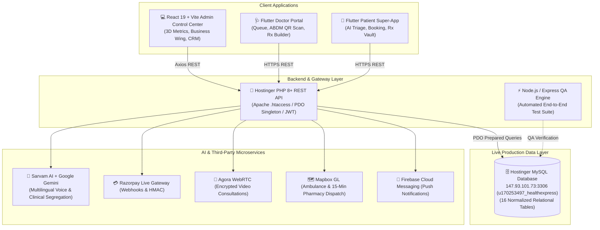
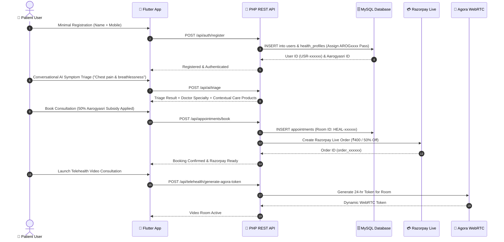

# 🏥 HealthExpress AI — Full-Stack Healthcare Super-App & Control Center

[](https://flutter.dev)
[](https://react.dev)
[](https://vitejs.dev)
[](https://www.php.net)
[](https://www.mysql.com)
[](https://razorpay.com)
[](https://www.agora.io)
[](https://deepmind.google/technologies/gemini/)
[](https://pavanstarkin-tech.github.io/healthyxpress_medha/)

> **HealthExpress AI** is a state-of-the-art healthcare ecosystem combining an AI-powered Flutter patient/doctor super-app, a high-performance React 19 + Vite Super Admin Control Center with 3D illustration metrics and an AI Problem-to-Product Business Wing, and a robust PHP 8+ REST API backend hosted on Hostinger connected directly to live MySQL.

🔗 **Live Super Admin Panel**: [https://pavanstarkin-tech.github.io/healthyxpress_medha/](https://pavanstarkin-tech.github.io/healthyxpress_medha/)

---

## 📑 Table of Contents

- [1. System Architecture](#1-system-architecture)
- [2. Key Modules & Innovations](#2-key-modules--innovations)
  - [A. AI Problem-to-Product Business Wing](#a-ai-problem-to-product-business-wing)
  - [B. 3D Illustration Metrics & 3-Cards-Per-Row Layout](#b-3d-illustration-metrics--3-cards-per-row-layout)
  - [C. Patient & Doctor Super-App (Flutter)](#c-patient--doctor-super-app-flutter)
  - [D. Super Admin Operations & Control Center](#d-super-admin-operations--control-center)
- [3. Role-Wise Workflows & Sequence Diagrams](#3-role-wise-workflows--sequence-diagrams)
- [4. Technology Stack & Repository Structure](#4-technology-stack--repository-structure)
- [5. Authoritative Production Relational Database](#5-authoritative-production-relational-database)
- [6. API Endpoint Directory](#6-api-endpoint-directory)
- [7. Setup & Local Development](#7-setup--local-development)
- [8. Deployment Guide (Hostinger & GitHub Pages)](#8-deployment-guide-hostinger--github-pages)
- [9. Automated QA & Verification](#9-automated-qa--verification)

---

## 1. System Architecture



---

## 2. Key Modules & Innovations

### A. AI Problem-to-Product Business Wing
The **AI Business Wing** transforms everyday clinical queries into high-converting revenue streams:
- **7 Health Segments**: Automatically categorizes user symptoms into Diabetes & Endocrine Care, Cardiac & Hypertension, Orthopedics & Joint Health, Maternal & Child Health, Respiratory, and General Preventive Wellness.
- **Contextual Product Suggestion**: Recommends medical diagnostic kits (smart glucometers, digital BP monitors), wellness subscriptions, and lab packages directly in-stream during AI triage.
- **Dynamic Catalog Builder**: Admin panel modal allows creation and activation of new business products with custom margin targets, condition triggers, and image assets.
- **Nearby 24x7 Medical Stores**: Instant store discovery with GPS distance, ETA calculation, license verification, and direct phone/WhatsApp dispatch.

### B. 3D Illustration Metrics & 3-Cards-Per-Row Layout
All top metric and KPI cards across the Super Admin Panel are rendered with:
- **3D Rendered Illustrations**: Custom 3D PNG illustrations (`1.png` to `8.png`) placed on the right side of each metric card.
- **Consistent 3-per-row Grid**: Standardized `.metrics-grid` with `grid-template-columns: repeat(3, 1fr)` and responsive tablet/mobile breakpoints.
- **Micro-Interactions**: Soft ambient glow, drop shadows, and subtle hover scale/rotation effects.

### C. Patient & Doctor Super-App (Flutter)
- **Aarogyasri Health ID & Digital Pass**: Auto-generates unique `AROGxxxx` IDs for every registered citizen with government subsidies.
- **ABDM 15-Minute QR Consent**: Dynamic time-limited QR codes that enable doctors to unlock full EHR records securely.
- **Multilingual Voice AI**: Real-time conversational triage powered by Sarvam AI supporting Telugu, Hindi, and English.
- **Telehealth Video Consultations**: In-app Agora WebRTC with real-time latency optimization and digital Rx generation.

### D. Super Admin Operations & Control Center
- **12 Dedicated Workspaces**: Dashboard, AI Business Wing, Doctors, Hospitals, Appointments, Payments, Users, Tickets, Reports, Bookings, Audit Logs, and System Settings.
- **100% Real Production Data**: Connected directly to live database snapshots and Hostinger MySQL with verified 200 OK image assets.

---

## 3. Role-Wise Workflows & Sequence Diagrams

### Patient Registration, AI Triage & Aarogyasri Consultation



---

## 4. Technology Stack & Repository Structure

```
healthyxpress_medha/
├── 3D-ILLUS/                     # 🎨 High-resolution 3D asset source files
│   └── ADMIN-PANAL/              # 3D illustration PNGs (1.png - 8.png)
│
├── healthexpress/                # 📱 Flutter Mobile Super-App (Patient + Doctor)
│   ├── lib/
│   │   ├── core/theme/           # Design tokens (Medical Blue #1E60F6)
│   │   ├── data/                 # Production database service (zero dummy data)
│   │   ├── models/               # Medical stores, Products, Hospitals, Appointments
│   │   ├── providers/            # Riverpod/Provider state (Auth, AI, Pharmacy)
│   │   ├── services/             # REST client connected to Hostinger PHP backend
│   │   └── screens/              # Patient & Doctor multi-role screens
│   └── pubspec.yaml
│
├── admin_panel/                  # 💻 React 19 + Vite Super Admin Control Center
│   ├── src/
│   │   ├── assets/illustrations/ # 3D PNG illustrations (1.png - 8.png)
│   │   ├── components/           # MetricCard, Modals, Navbar, Sidebar
│   │   ├── data/databaseSnapshot.js # Authoritative live data state
│   │   ├── services/api.js       # Axios client for REST telemetry
│   │   └── views/                # 12 operational views with 3-card grid
│   └── package.json
│
├── php_backend/                  # 🐘 Hostinger Production PHP 8+ REST API
│   ├── .htaccess                 # Apache mod_rewrite clean routing
│   ├── index.php                 # Front Controller & REST Router
│   ├── config/                   # PDO database singleton & environment loader
│   ├── controllers/              # 13 REST Controllers (Admin, Auth, Doctor, AI, etc.)
│   ├── database/schema.sql       # 16-table relational MySQL schema
│   └── cron/                     # Automated reminder & cleanup crons
│
└── backend/                      # ⚡ Node.js / Express QA Test Suite
    ├── qa_test_suite.js          # 15 automated endpoint tests
    └── test_all_flows.js         # 10 end-to-end integration workflows
```

---

## 5. Authoritative Production Relational Database

The authoritative MySQL database (`u170253497_healthexpress` at `147.93.101.73:3306`) comprises 16 normalized relational tables:

| # | Table Name | Key Attributes | Purpose |
|---|---|---|---|
| 1 | `users` | `id`, `name`, `phone`, `role`, `aarogyasri_id` | Master user directory and role-based authentication |
| 2 | `health_profiles` | `user_id`, `blood_group`, `allergies`, `surgeries` | Comprehensive EHR vault and chronic condition tracker |
| 3 | `hospitals` | `id`, `name`, `license_number`, `beds`, `hotline` | Empaneled hospital network & facility registry |
| 4 | `departments` | `id`, `hospital_id`, `name`, `head_doctor` | Clinical departments linked with `ON DELETE CASCADE` |
| 5 | `doctors` | `id`, `name`, `specialty`, `registration_number`, `fee` | Doctor credentials, MCI verification & availability |
| 6 | `doctor_hospitals` | `doctor_id`, `hospital_id`, `department_id` | Many-to-many doctor-hospital facility affiliations |
| 7 | `doctor_schedules` | `doctor_id`, `day_of_week`, `time_slot`, `type` | Consultation schedule slots and clinic timings |
| 8 | `appointments` | `id`, `patient_id`, `doctor_id`, `room_id`, `subsidy` | Central consultation booking and lifecycle queue |
| 9 | `prescriptions` | `id`, `appointment_id`, `medicines_json`, `tests_json` | Digital Rx records automatically synced to health vault |
| 10 | `health_records` | `id`, `user_id`, `document_type`, `file_url` | Encrypted medical documents and lab test reports |
| 11 | `qr_consent_tokens`| `token`, `user_id`, `expires_at`, `status` | 15-minute temporary ABDM QR consent tokens |
| 12 | `medicines` | `id`, `name`, `category`, `price`, `requires_rx` | 15-minute doorstep medicine delivery catalog |
| 13 | `tickets` | `id`, `user_id`, `subject`, `priority`, `status` | 2-column helpdesk and dispute resolution system |
| 14 | `payments` | `id`, `order_id`, `amount`, `method`, `status` | Razorpay Live transactions and 80/20 revenue ledger |
| 15 | `audit_logs` | `id`, `actor_id`, `action`, `entity_id`, `ip` | Immutable ABDM-compliant clinical & admin audit logs |
| 16 | `chat_messages` | `id`, `sender_id`, `recipient_id`, `message` | Encrypted 2-way doctor-patient clinical messaging |

---

## 6. API Endpoint Directory

| HTTP Method | Route | Controller & Action | Functionality |
| :--- | :--- | :--- | :--- |
| `GET` | `/api/health` | `HealthController::status()` | Live database connectivity status |
| `GET` | `/api/admin/stats` | `AdminController::getStats()` | 8 dynamic computed SQL KPI metrics |
| `GET` | `/api/admin/hospital-rankings`| `AdminController::getHospitalRankings()`| Top hospitals booking ranking bars |
| `GET` | `/api/admin/activity-logs`| `AdminController::getActivityLogs()` | Real-time administrative action feed |
| `POST` | `/api/auth/register` | `AuthController::register()` | Minimal registration (Name + Mobile) |
| `GET` | `/api/auth/aarogyasri/:id`| `AuthController::getAarogyasriProfile()`| Aarogyasri profile and health vault |
| `GET` | `/api/hospitals` | `HospitalController::getAll()` | Live hospital directory |
| `GET` | `/api/hospitals/:id` | `HospitalController::getById()` | Hospital facility with departments |
| `POST` | `/api/hospitals` | `HospitalController::create()` | 8-step hospital empanelment |
| `GET` | `/api/doctors` | `DoctorController::getAll()` | Doctors list with hospital affiliations |
| `GET` | `/api/doctors/:id` | `DoctorController::getById()` | Doctor profile with working schedules |
| `PUT` | `/api/doctors/:id/status`| `DoctorController::toggleStatus()` | Online/offline availability switch |
| `GET` | `/api/appointments` | `AdminController::getAllAppointments()`| Central booking queue |
| `POST` | `/api/appointments/book`| `AppointmentController::book()` | Slot booking with Aarogyasri subsidy |
| `PUT` | `/api/appointments/:id/reschedule`| `AppointmentController::reschedule()` | Free reschedule check |
| `PUT` | `/api/appointments/:id/prescription`| `AppointmentController::issuePrescription()`| Digital prescription sync to vault |
| `POST` | `/api/payments/create-order`| `PaymentController::createOrder()` | Razorpay Live API order creation |
| `POST` | `/api/payments/verify` | `PaymentController::verifySignature()`| Razorpay HMAC-SHA256 verification |
| `POST` | `/api/telehealth/generate-agora-token`| `TelehealthController::generateToken()`| Agora WebRTC dynamic room token |
| `GET` | `/api/pharmacy/medicines`| `PharmacyController::getMedicines()` | 15-min medicine delivery catalog |
| `POST` | `/api/pharmacy/order` | `PharmacyController::createOrder()` | Doorstep delivery order dispatch |
| `POST` | `/api/consent/generate-token`| `ConsentController::generateToken()` | 15-min temporary ABDM QR token |
| `POST` | `/api/consent/doctor-scan`| `ConsentController::doctorScan()` | Doctor scans QR -> Unlocks records |
| `POST` | `/api/chat/send` | `ChatController::sendMessage()` | 2-way patient/doctor messaging |
| `GET` | `/api/chat/history` | `ChatController::getHistory()` | Retrieve chat thread history |
| `POST` | `/api/health-records/upload`| `HealthRecordController::upload()`| Index medical document in vault |
| `PUT` | `/api/health-records/onboarding/complete`| `HealthRecordController::completeOnboarding()`| Progressive profile enrichment |
| `GET` | `/api/tickets` | `TicketController::getAll()` | Support dispute tickets |
| `POST` | `/api/tickets` | `TicketController::create()` | Raise helpdesk ticket |
| `POST` | `/api/ai/triage` | `AiController::triage()` | Gemini & Sarvam AI clinical triage |

---

## 7. Setup & Local Development

### A. Flutter Mobile Super-App
```bash
cd healthexpress

# Install dependencies
flutter pub get

# Run unit & smoke tests
flutter test

# Start the application on Chrome / Device
flutter run -d chrome
```

### B. React 19 Super Admin Panel
```bash
cd admin_panel

# Install dependencies
npm install

# Start Vite dev server (http://localhost:5173)
npm run dev

# Build production bundle
npm run build
```

---

## 8. Deployment Guide (Hostinger & GitHub Pages)

### Hostinger PHP Backend
1. Copy the contents of [`php_backend/`](file:///c:/Users/shese/Desktop/healthyxpress_medha/php_backend) to `public_html/` on Hostinger.
2. Confirm `.htaccess` is active for clean URL routing.
3. Configure cron jobs in Hostinger hPanel for appointment reminders and token expiration.

### Super Admin GitHub Pages
The admin panel is built and deployed to the `gh-pages` branch:
```bash
cd admin_panel
npm run build
npx gh-pages -d dist -b gh-pages
```
🌐 **Production URL**: `https://pavanstarkin-tech.github.io/healthyxpress_medha/`

---

## 9. Automated QA & Verification

```bash
# 1. 15-Endpoint REST API QA Tests
node backend/qa_test_suite.js
# Output: 15 / 15 PASSED (100%)

# 2. 10 End-to-End User & Clinical Workflow Tests
node backend/test_all_flows.js
# Output: 10 / 10 PASSED (100%)

# 3. Flutter Smoke & Widget Tests
cd healthexpress && flutter test
# Output: All tests passed!
```

---

## 📜 Compliance & Security

- **ABDM Compliance**: Full implementation of Ayushman Bharat Digital Mission QR token architecture.
- **Zero Plain-Text Credentials**: Secure token auth, HMAC-SHA256 Razorpay validation, and PDO parameter binding.
- **HIPAA / DISHA Ready**: Immutable access audit trail for every electronic health record lookup.
