# 🏥 HealthExpress AI — Intelligent Healthcare Platform & Control Center

[](https://bob.ibm.com/)
[](https://flutter.dev)
[](https://react.dev)
[](https://vitejs.dev)
[](https://www.php.net)
[](https://mariadb.org)
[](https://www.nvidia.com)
[](https://sarvam.ai)
[](https://www.agora.io)
[](https://www.mapbox.com)
[](https://razorpay.com)
[](https://pavanstarkin-tech.github.io/healthyxpress_medha/)

> **HealthExpress AI** is an end-to-end, high-performance healthcare super-app and operational command center. It unifies **multilingual voice-first AI clinical intake (Telugu, Hindi, English)**, **embedded Agora HD video teleconsultations**, **15-minute hyperlocal dark-store emergency medicine delivery**, **home diagnostic lab test sample collections**, and **ABDM & Aarogyasri government health scheme integrations** into a single, synchronized platform.

---

## 🌐 Live Production Links

* **📱 Patient & Doctor Web App**: [https://pavanstarkin-tech.github.io/healthyxpress_medha/](https://pavanstarkin-tech.github.io/healthyxpress_medha/)
* **💻 Super Admin & Hospital Operations Dashboard**: [https://pavanstarkin-tech.github.io/healthyxpress_medha/admin/](https://pavanstarkin-tech.github.io/healthyxpress_medha/admin/)
* **🐘 Live Hostinger REST API Health**: [https://vedvaidyam.com/healthexpress/api/health](https://vedvaidyam.com/healthexpress/api/health)

---

## 🤖 How We Used IBM Bob to Implement This Project

**HealthExpress AI** was architected, built, debugged, and deployed end-to-end utilizing **[IBM Bob](https://bob.ibm.com/)** as our AI software development partner across every layer of the technology stack.

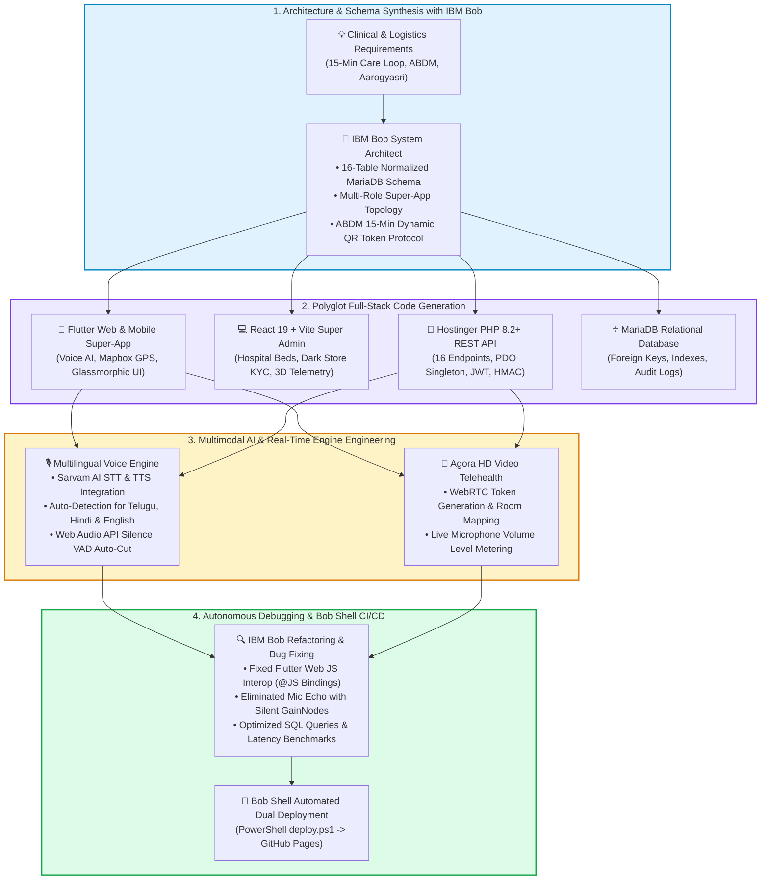
```mermaid
flowchart TD
    subgraph BobArchitecture["1. Architecture & Schema Synthesis with IBM Bob"]
        Spec["💡 Clinical & Logistics Requirements<br/>(15-Min Care Loop, ABDM, Aarogyasri)"] --> BobArch["🤖 IBM Bob System Architect<br/>• 16-Table Normalized MariaDB Schema<br/>• Multi-Role Super-App Topology<br/>• ABDM 15-Min Dynamic QR Token Protocol"]
    end

    subgraph BobCodeGen["2. Polyglot Full-Stack Code Generation"]
        BobArch --> BobFlutter["📱 Flutter Web & Mobile Super-App<br/>(Voice AI, Mapbox GPS, Glassmorphic UI)"]
        BobArch --> BobReact["💻 React 19 + Vite Super Admin<br/>(Hospital Beds, Dark Store KYC, 3D Telemetry)"]
        BobArch --> BobPHP["🐘 Hostinger PHP 8.2+ REST API<br/>(16 Endpoints, PDO Singleton, JWT, HMAC)"]
        BobArch --> BobSQL["🗄️ MariaDB Relational Database<br/>(Foreign Keys, Indexes, Audit Logs)"]
    end

    subgraph BobAIIntegration["3. Multimodal AI & Real-Time Engine Engineering"]
        BobFlutter & BobPHP --> BobVoice["🎙️ Multilingual Voice Engine<br/>• Sarvam AI STT & TTS Integration<br/>• Auto-Detection for Telugu, Hindi & English<br/>• Web Audio API Silence VAD Auto-Cut"]
        BobFlutter & BobPHP --> BobWebRTC["🎥 Agora HD Video Telehealth<br/>• WebRTC Token Generation & Room Mapping<br/>• Live Microphone Volume Level Metering"]
    end

    subgraph BobQA["4. Autonomous Debugging & Bob Shell CI/CD"]
        BobVoice & BobWebRTC --> BobFix["🔍 IBM Bob Refactoring & Bug Fixing<br/>• Fixed Flutter Web JS Interop (@JS Bindings)<br/>• Eliminated Mic Echo with Silent GainNodes<br/>• Optimized SQL Queries & Latency Benchmarks"]
        BobFix --> BobDeploy["🚀 Bob Shell Automated Dual Deployment<br/>(PowerShell deploy.ps1 -> GitHub Pages)"]
    end

    style BobArchitecture fill:#E0F2FE,stroke:#0284C7,stroke-width:2px
    style BobCodeGen fill:#EDE9FE,stroke:#7C3AED,stroke-width:2px
    style BobAIIntegration fill:#FEF3C7,stroke:#D97706,stroke-width:2px
    style BobQA fill:#DCFCE7,stroke:#16A34A,stroke-width:2px
```

### 1. Architecture Planning & Database Synthesis
* **Clinical & Operational Requirements Modeling**: We used IBM Bob to analyze healthcare compliance requirements (ABDM tokenized consent, Aarogyasri cashless pre-authorizations, and 15-minute dark-store geofencing SLAs) and translate them into a unified multi-role technical specification.
* **16-Table Normalized Relational Schema**: IBM Bob generated the complete production MariaDB relational schema (`u170253497_healthexpress`), defining primary/foreign key constraints, geolocation indexes, and immutable audit logs across users, doctors, hospitals, appointments, prescriptions, and pharmacy inventories.

### 2. Polyglot Full-Stack Code Generation
* **Flutter Patient & Doctor Super-App**: IBM Bob generated the complete client-side architecture using Riverpod & Provider state management, responsive UI layouts, glassmorphic design tokens, and Mapbox GL vector map integrations.
* **React 19 Super Admin Dashboard**: IBM Bob structured 12 operational command workspaces with live MariaDB telemetry, hospital bed capacity tracking, dark-store drug license verification queues, and revenue ledgers.
* **Hostinger PHP 8.2+ REST API**: IBM Bob generated 16 secure REST endpoints with PDO connection pooling, Apache `mod_rewrite` clean URL routing, parameterized SQL queries, and HMAC-SHA256 signature verification for Razorpay payments.

### 3. Multimodal Voice AI & Real-Time Telehealth Engineering
* **Auto-Language Detection & Voice Synthesis**: We leveraged IBM Bob to engineer the intelligent multilingual triage engine that automatically detects Telugu (`te`), Hindi (`hi`), or English (`en`)—including Romanized **Tanglish** (*"naku jwaram undi"*) and **Hinglish** (*"mujhe bukhar hai"*). IBM Bob locked the AI prompts to respond strictly in the detected language and synchronized Sarvam Bulbul regional HD voices (`kavitha`, `kavya`, `priya`).
* **Client-Side Audio Energy VAD Auto-Cut**: IBM Bob wrote the Web Audio API real-time Voice Activity Detection (VAD) algorithm in `web/index.html` with Root Mean Square (RMS) energy threshold analysis and silence auto-cut triggers.
* **Agora HD WebRTC Teleconsultation**: IBM Bob integrated 2-way video streaming, dynamic Agora RTC token generation, and real-time volume metering for patient-doctor calls.

### 4. Autonomous AI Agent Task Division & Bob Shell Automation
* **Parallel Milestone Execution**: IBM Bob divided complex full-stack milestones into parallel sub-tasks—scaffolding backend API endpoints simultaneously with frontend state providers without architectural drift.
* **Codebase Debugging & Refactoring**: IBM Bob diagnosed and fixed browser WebRTC video PiP permissions, corrected JavaScript `@JS` interop bindings in Flutter Web, and resolved audio loopback echoes by injecting silent `GainNode` routing.
* **Automated Dual-Deployment (`deploy.ps1`)**: We used IBM Bob Shell to automate the compilation of Flutter Web (`/`) and React Admin (`/admin/`), pushing unified production builds to GitHub Pages with 0 static analysis errors.

---

## 📑 Table of Contents

1. [User Interface & Screen Gallery](#1-user-interface--screen-gallery)
2. [System Architecture](#2-system-architecture)
3. [Venn Diagram: HealthExpress Convergence](#3-venn-diagram-healthexpress-convergence)
4. [Core Workflows & Detailed Flowcharts](#4-core-workflows--detailed-flowcharts)
   - [A. The "Golden 15-Minute" Care Loop](#a-the-golden-15-minute-care-loop)
   - [B. Multilingual Voice AI Triage & Intake Engine](#b-multilingual-voice-ai-triage--intake-engine)
   - [C. Doctor Teleconsultation & Live E-Prescription Workflow](#c-doctor-teleconsultation--live-e-prescription-workflow)
   - [D. 15-Minute Hyperlocal Dark Store Medicine Dispatch](#d-15-minute-hyperlocal-dark-store-medicine-dispatch)
   - [E. ABDM QR Consent & Aarogyasri Health Pass Verification](#e-abdm-qr-consent--aarogyasri-health-pass-verification)
5. [State Diagrams & Lifecycle State Machines](#5-state-diagrams--lifecycle-state-machines)
   - [A. Multilingual Clinical AI Triage State Machine](#a-multilingual-clinical-ai-triage-state-machine)
   - [B. 15-Minute Medicine Order Lifecycle](#b-15-minute-medicine-order-lifecycle)
   - [C. Video Teleconsultation State Machine](#c-video-teleconsultation-state-machine)
6. [Role-Wise Capabilities & Feature Matrix](#6-role-wise-capabilities--feature-matrix)
7. [Production Relational Database Schema & ER Diagram](#7-production-relational-database-schema--er-diagram)
8. [Complete REST API Endpoint Directory](#8-complete-rest-api-endpoint-directory)
9. [Technology Stack & Directory Structure](#9-technology-stack--directory-structure)
10. [Setup, Local Development & Deployment Guide](#10-setup-local-development--deployment-guide)
11. [Compliance & Clinical Standards](#11-compliance--clinical-standards)

---

## 1. User Interface & Screen Gallery

### 📱 A. Patient Super-App — Home, Hospital Beds & Live Mapbox GPS
| Splash & Welcome | Patient Super-App Home | Nearby Hospitals & Beds | Mapbox GL GPS Map | Hospital Facility Details |
| :---: | :---: | :---: | :---: | :---: |
| 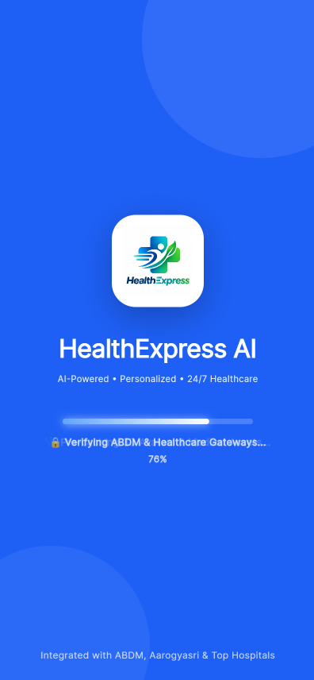 | 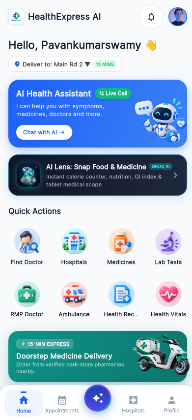 | 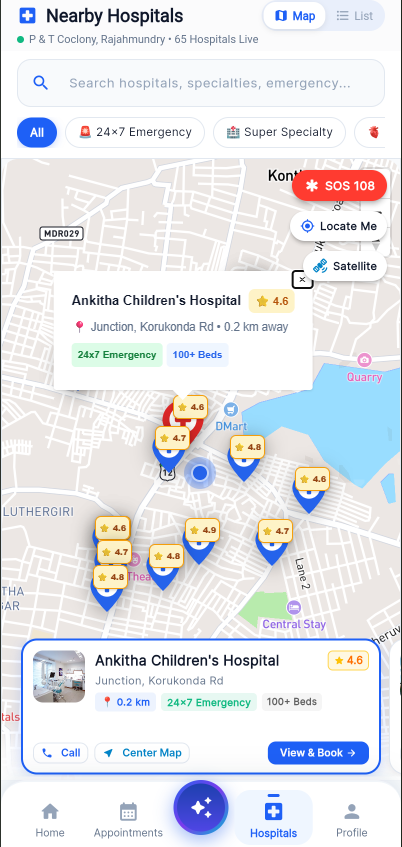 | 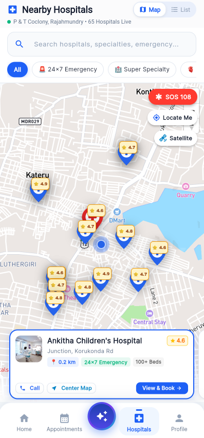 | 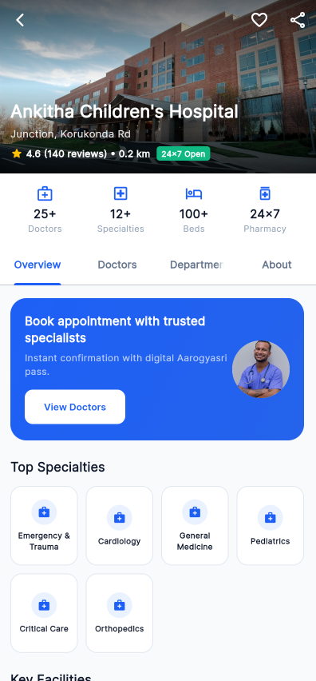 |

### 🧠 B. Multilingual Voice AI Triage & Groq AI Vision Scanner
| Multilingual AI Chat | Live AI Voice Call | Auto-Language Selection | AI Lens Scanner | Live Camera Capture | Instant AI Vision Diagnosis |
| :---: | :---: | :---: | :---: | :---: | :---: |
| 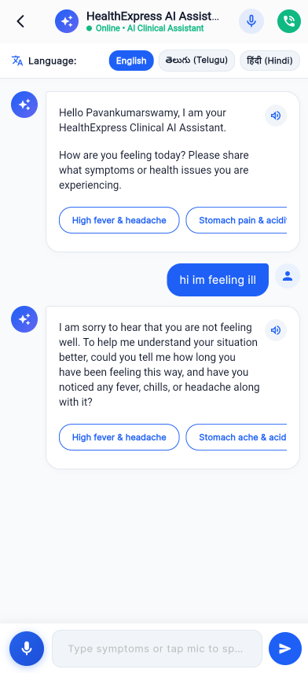 | 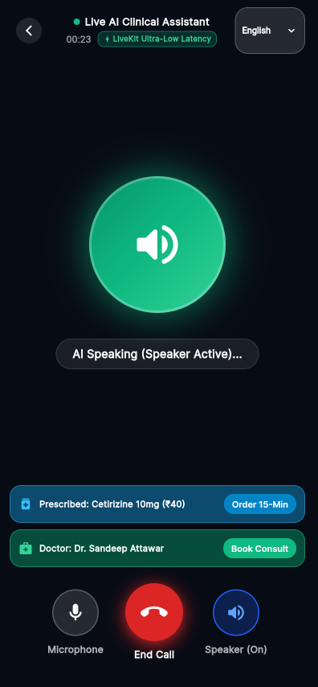 | 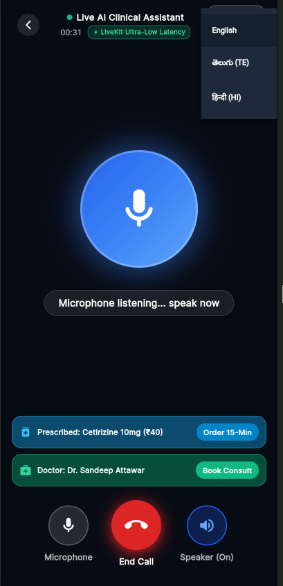 | 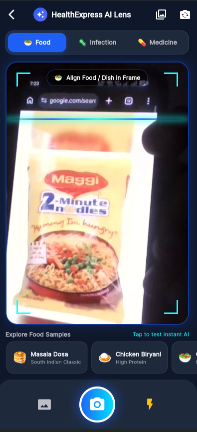 | 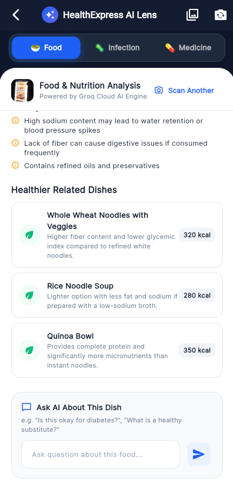 |  |

### 🩺 C. Doctor Discovery, Teleconsultation & Digital E-Prescriptions
| Doctor Discovery | Slot Selection & Booking | Booking Confirmation | Patient Appointments | Agora HD Video Call | Live Audio Telehealth | Doctor-Patient Chat | Digital E-Prescription |
| :---: | :---: | :---: | :---: | :---: | :---: | :---: | :---: |
| 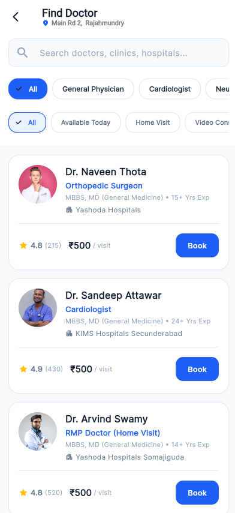 | 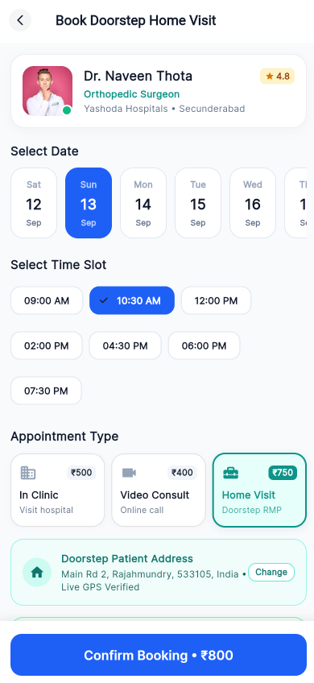 | 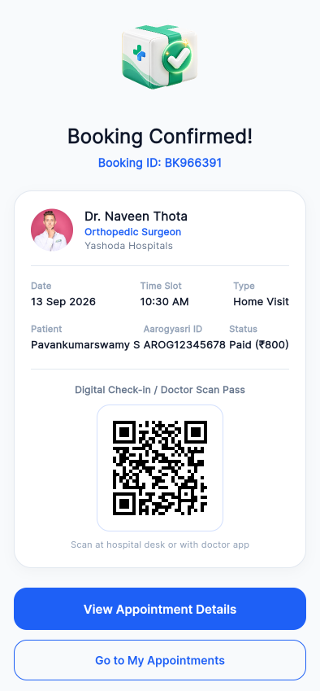 | 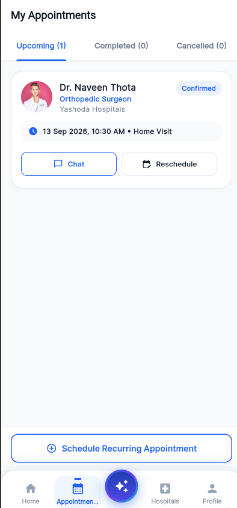 | 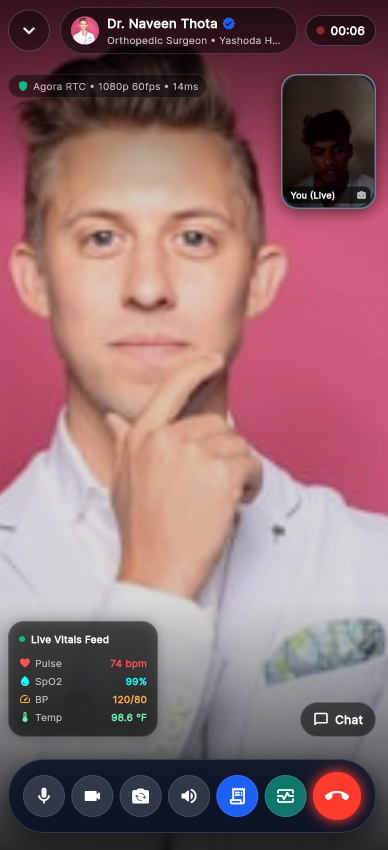 | 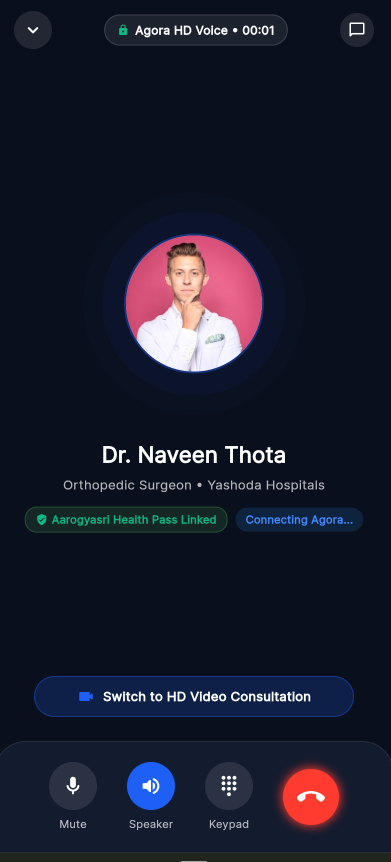 |  |  |

### 👨‍⚕️ D. Doctor Telehealth Console, ABDM EHR Vault & Aarogyasri Health Pass
| Doctor Portal Home | Doctor Appointment Queue | AI Clinical Analysis | Doctor Practice Profile | ABDM Patient EHR Records | Aarogyasri 5L Health Pass | ABDM Health Locker |
| :---: | :---: | :---: | :---: | :---: | :---: | :---: |
| 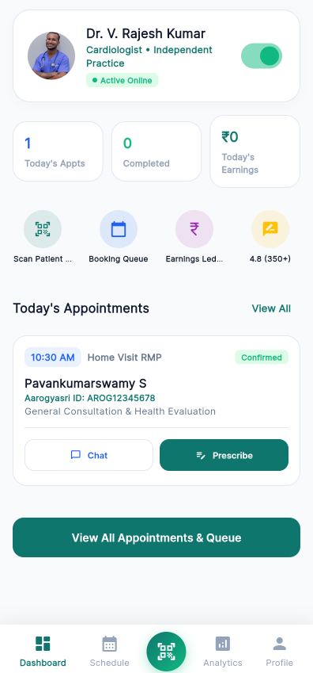 | 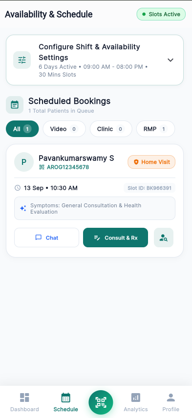 | 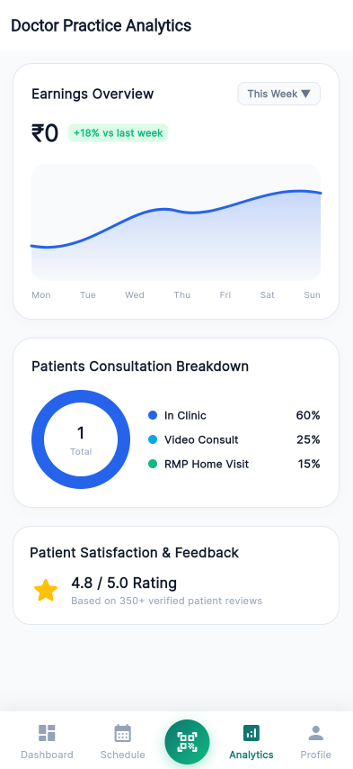 |  |  |  |  |

### 💻 E. Super Admin & Hospital Operations Command Center (React 19 Dashboard)
| 1. Platform Telemetry & KPIs | 2. Hospital Beds & ICU Tracking | 3. Doctor Credentials Verification | 4. Pharmacy Dark Store KYC Queue |
| :---: | :---: | :---: | :---: |
|  |  |  |  |

| 5. 15-Min Pharmacy Inventory | 6. Emergency 108 GPS Dispatch | 7. Diagnostic Lab Test Orders | 8. Revenue Ledger & Settlements |
| :---: | :---: | :---: | :---: |
|  |  |  |  |

---

## 2. System Architecture

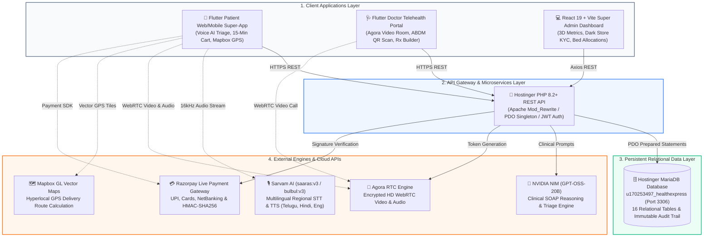
```mermaid
graph TD
    subgraph ClientLayer["1. Client Applications Layer"]
        PatientApp["📱 Flutter Patient Web/Mobile Super-App<br/>(Voice AI Triage, 15-Min Cart, Mapbox GPS)"]
        DoctorApp["🩺 Flutter Doctor Telehealth Portal<br/>(Agora Video Room, ABDM QR Scan, Rx Builder)"]
        AdminApp["💻 React 19 + Vite Super Admin Dashboard<br/>(3D Metrics, Dark Store KYC, Bed Allocations)"]
    end

    subgraph APILayer["2. API Gateway & Microservices Layer"]
        PHPBackend["🐘 Hostinger PHP 8.2+ REST API<br/>(Apache Mod_Rewrite / PDO Singleton / JWT Auth)"]
    end

    subgraph DatabaseLayer["3. Persistent Relational Data Layer"]
        LiveDB[("🗄️ Hostinger MariaDB Database<br/>u170253497_healthexpress (Port 3306)<br/>16 Relational Tables & Immutable Audit Trail")]
    end

    subgraph CloudServices["4. External Engines & Cloud APIs"]
        SarvamAI["🎙️ Sarvam AI (saaras:v3 / bulbul:v3)<br/>Multilingual Regional STT & TTS (Telugu, Hindi, Eng)"]
        NvidiaNIM["🧠 NVIDIA NIM (GPT-OSS-20B)<br/>Clinical SOAP Reasoning & Triage Engine"]
        AgoraRTC["🎥 Agora RTC Engine<br/>Encrypted HD WebRTC Video & Audio"]
        MapboxGL["🗺️ Mapbox GL Vector Maps<br/>Hyperlocal GPS Delivery Route Calculation"]
        RazorpayGW["💳 Razorpay Live Payment Gateway<br/>UPI, Cards, NetBanking & HMAC-SHA256"]
    end

    PatientApp -->|HTTPS REST| PHPBackend
    DoctorApp -->|HTTPS REST| PHPBackend
    AdminApp -->|Axios REST| PHPBackend

    PatientApp -.->|16kHz Audio Stream| SarvamAI
    PatientApp -.->|WebRTC Video & Audio| AgoraRTC
    PatientApp -.->|Vector GPS Tiles| MapboxGL
    PatientApp -.->|Payment SDK| RazorpayGW

    DoctorApp -.->|WebRTC Video Call| AgoraRTC

    PHPBackend -->|PDO Prepared Statements| LiveDB
    PHPBackend -->|Clinical Prompts| NvidiaNIM
    PHPBackend -->|Token Generation| AgoraRTC
    PHPBackend -->|Signature Verification| RazorpayGW

    style ClientLayer fill:#F8FAFC,stroke:#64748B,stroke-width:2px
    style APILayer fill:#EFF6FF,stroke:#3B82F6,stroke-width:2px
    style DatabaseLayer fill:#ECFDF5,stroke:#10B981,stroke-width:2px
    style CloudServices fill:#FFF7ED,stroke:#F97316,stroke-width:2px
```

---

## 3. Venn Diagram: HealthExpress Convergence

HealthExpress AI unites four traditionally disconnected healthcare silos into an integrated patient experience:

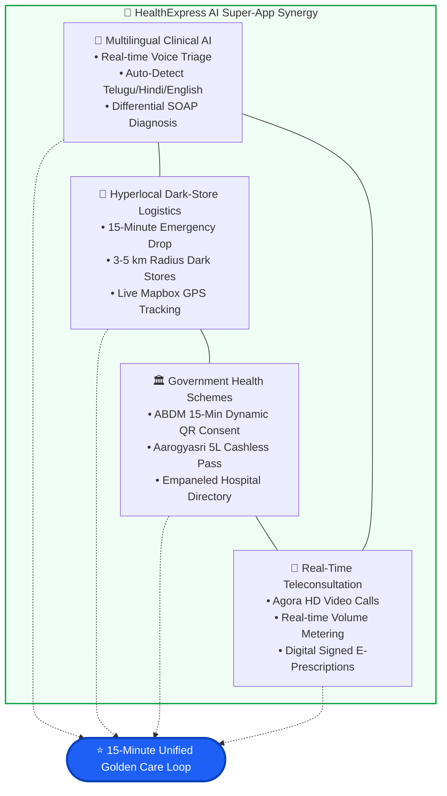
```mermaid
flowchart TD
    subgraph HealthExpressSuperApp["🏥 HealthExpress AI Super-App Synergy"]
        A["🧠 Multilingual Clinical AI<br/>• Real-time Voice Triage<br/>• Auto-Detect Telugu/Hindi/English<br/>• Differential SOAP Diagnosis"]
        B["🏬 Hyperlocal Dark-Store Logistics<br/>• 15-Minute Emergency Drop<br/>• 3-5 km Radius Dark Stores<br/>• Live Mapbox GPS Tracking"]
        C["🏛️ Government Health Schemes<br/>• ABDM 15-Min Dynamic QR Consent<br/>• Aarogyasri 5L Cashless Pass<br/>• Empaneled Hospital Directory"]
        D["🎥 Real-Time Teleconsultation<br/>• Agora HD Video Calls<br/>• Real-time Volume Metering<br/>• Digital Signed E-Prescriptions"]
    end

    A --- B
    B --- C
    C --- D
    D --- A

    A -.-> Core(["⭐ 15-Minute Unified Golden Care Loop"])
    B -.-> Core
    C -.-> Core
    D -.-> Core

    style HealthExpressSuperApp fill:#F0FDF4,stroke:#16A34A,stroke-width:2px
    style Core fill:#1E60F6,color:#FFFFFF,stroke:#0B42BA,stroke-width:3px
```

---

## 4. Core Workflows & Detailed Flowcharts

### A. The "Golden 15-Minute" Care Loop

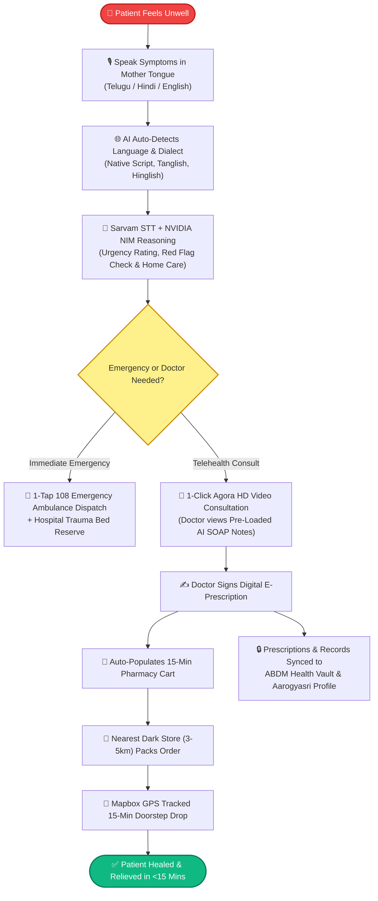
```mermaid
flowchart TD
    Start([👤 Patient Feels Unwell]) --> VoiceIntake["🎙️ Speak Symptoms in Mother Tongue<br/>(Telugu / Hindi / English)"]
    VoiceIntake --> AutoDetect["🌐 AI Auto-Detects Language & Dialect<br/>(Native Script, Tanglish, Hinglish)"]
    AutoDetect --> AITriage["🧠 Sarvam STT + NVIDIA NIM Reasoning<br/>(Urgency Rating, Red Flag Check & Home Care)"]
    AITriage --> Decision{Emergency or Doctor Needed?}
    
    Decision -- Immediate Emergency --> SOS["🚨 1-Tap 108 Emergency Ambulance Dispatch<br/>+ Hospital Trauma Bed Reserve"]
    Decision -- Telehealth Consult --> VideoDoc["🎥 1-Click Agora HD Video Consultation<br/>(Doctor views Pre-Loaded AI SOAP Notes)"]
    
    VideoDoc --> DigitalRx["✍️ Doctor Signs Digital E-Prescription"]
    DigitalRx --> AutoCart["🛒 Auto-Populates 15-Min Pharmacy Cart"]
    
    AutoCart --> DarkStore["🏬 Nearest Dark Store (3-5km) Packs Order"]
    DarkStore --> Dispatch["🛵 Mapbox GPS Tracked 15-Min Doorstep Drop"]
    
    DigitalRx --> ABDMVault["🔒 Prescriptions & Records Synced to<br/>ABDM Health Vault & Aarogyasri Profile"]
    Dispatch --> Delivered([✅ Patient Healed & Relieved in <15 Mins])

    style Start fill:#EF4444,color:#FFFFFF,stroke:#B91C1C,stroke-width:2px
    style Delivered fill:#10B981,color:#FFFFFF,stroke:#047857,stroke-width:2px
    style Decision fill:#FEF08A,stroke:#CA8A04,stroke-width:2px
```

---

### B. Multilingual Voice AI Triage & Intake Engine

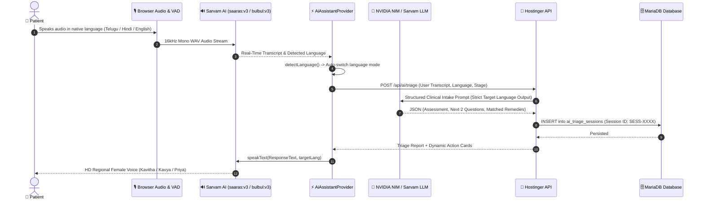
```mermaid
sequenceDiagram
    autonumber
    actor User as 👤 Patient
    participant Mic as 🎙️ Browser Audio & VAD
    participant Sarvam as 🔊 Sarvam AI (saaras:v3 / bulbul:v3)
    participant Provider as ⚡ AiAssistantProvider
    participant NIM as 🧠 NVIDIA NIM / Sarvam LLM
    participant PHP as 🐘 Hostinger API
    participant DB as 🗄️ MariaDB Database

    User->>Mic: Speaks audio in native language (Telugu / Hindi / English)
    Mic->>Sarvam: 16kHz Mono WAV Audio Stream
    Sarvam-->>Provider: Real-Time Transcript & Detected Language
    
    Provider->>Provider: detectLanguage() -> Auto-switch language mode
    Provider->>PHP: POST /api/ai/triage (User Transcript, Language, Stage)
    PHP->>NIM: Structured Clinical Intake Prompt (Strict Target Language Output)
    NIM-->>PHP: JSON (Assessment, Next 2 Questions, Matched Remedies)
    
    PHP->>DB: INSERT into ai_triage_sessions (Session ID: SESS-XXXX)
    DB-->>PHP: Persisted
    PHP-->>Provider: Triage Report + Dynamic Action Cards
    Provider->>Sarvam: speakText(ResponseText, targetLang)
    Sarvam-->>User: HD Regional Female Voice (Kavitha / Kavya / Priya)
```

---

### C. Doctor Teleconsultation & Live E-Prescription Workflow

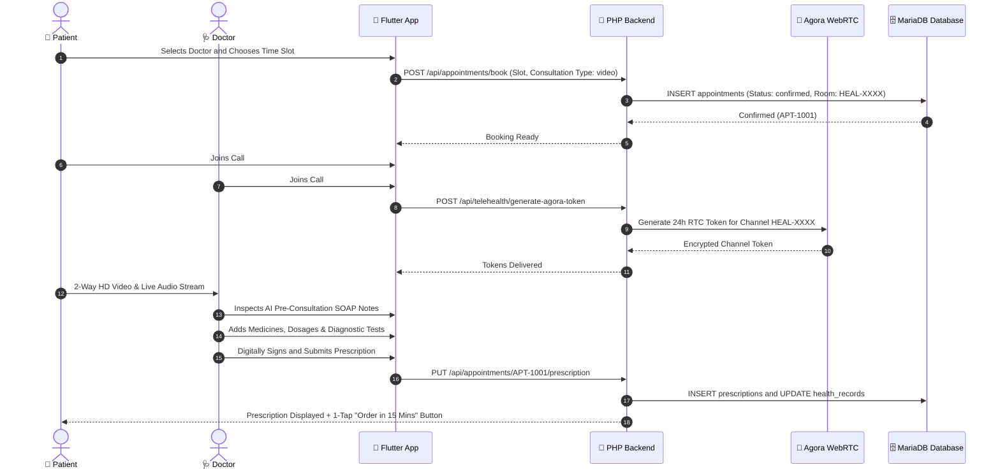
```mermaid
sequenceDiagram
    autonumber
    actor Patient as 👤 Patient
    actor Doctor as 🩺 Doctor
    participant App as 📱 Flutter App
    participant API as 🐘 PHP Backend
    participant Agora as 🎥 Agora WebRTC
    participant DB as 🗄️ MariaDB Database

    Patient->>App: Selects Doctor and Chooses Time Slot
    App->>API: POST /api/appointments/book (Slot, Consultation Type: video)
    API->>DB: INSERT appointments (Status: confirmed, Room: HEAL-XXXX)
    DB-->>API: Confirmed (APT-1001)
    API-->>App: Booking Ready
    
    Patient->>App: Joins Call
    Doctor->>App: Joins Call
    App->>API: POST /api/telehealth/generate-agora-token
    API->>Agora: Generate 24h RTC Token for Channel HEAL-XXXX
    Agora-->>API: Encrypted Channel Token
    API-->>App: Tokens Delivered

    Patient->>Doctor: 2-Way HD Video & Live Audio Stream
    Doctor->>App: Inspects AI Pre-Consultation SOAP Notes
    Doctor->>App: Adds Medicines, Dosages & Diagnostic Tests
    Doctor->>App: Digitally Signs and Submits Prescription
    App->>API: PUT /api/appointments/APT-1001/prescription
    API->>DB: INSERT prescriptions and UPDATE health_records
    API-->>Patient: Prescription Displayed + 1-Tap "Order in 15 Mins" Button
```

---

### D. 15-Minute Hyperlocal Dark Store Medicine Dispatch


```mermaid
flowchart LR
    subgraph OrderPlacement["1. Order Placement"]
        Prescription["📄 E-Prescription / Search"] --> StockCheck["🔍 Real-Time Shelf Stock Verification"]
        StockCheck --> Payment["💳 Instant Razorpay / Aarogyasri Cashless"]
    end

    subgraph DarkStoreProcessing["2. Dark Store Processing"]
        Payment --> DarkStoreQueue["🏬 Nearest Verified Dark Store<br/>(3-5 km Radius SLA)"]
        DarkStoreQueue --> PickPack["📦 Pharmacist Picks & Packs Order"]
        PickPack --> RiderAssign["🛵 Delivery Partner Assigned"]
    end

    subgraph LiveNavigation["3. Live GPS Drop"]
        RiderAssign --> MapboxGPS["🗺️ Mapbox GL Live Vector GPS Tracking"]
        MapboxGPS --> Doorstep["🚪 Doorstep Drop in < 15 Mins"]
    end

    style OrderPlacement fill:#EFF6FF,stroke:#3B82F6,stroke-width:1px
    style DarkStoreProcessing fill:#FEF3C7,stroke:#D97706,stroke-width:1px
    style LiveNavigation fill:#DCFCE7,stroke:#16A34A,stroke-width:1px
```

---

### E. ABDM QR Consent & Aarogyasri Health Pass Verification

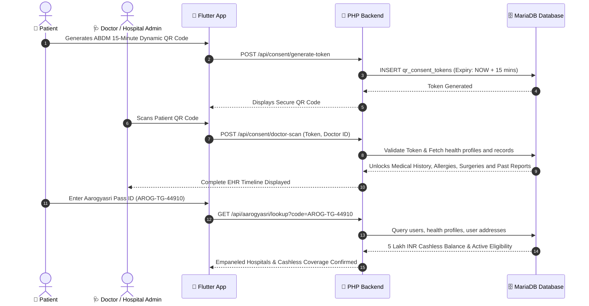
```mermaid
sequenceDiagram
    autonumber
    actor Patient as 👤 Patient
    actor Doctor as 🩺 Doctor / Hospital Admin
    participant App as 📱 Flutter App
    participant API as 🐘 PHP Backend
    participant DB as 🗄️ MariaDB Database

    Patient->>App: Generates ABDM 15-Minute Dynamic QR Code
    App->>API: POST /api/consent/generate-token
    API->>DB: INSERT qr_consent_tokens (Expiry: NOW + 15 mins)
    DB-->>API: Token Generated
    API-->>App: Displays Secure QR Code

    Doctor->>App: Scans Patient QR Code
    App->>API: POST /api/consent/doctor-scan (Token, Doctor ID)
    API->>DB: Validate Token & Fetch health profiles and records
    DB-->>API: Unlocks Medical History, Allergies, Surgeries and Past Reports
    API-->>Doctor: Complete EHR Timeline Displayed

    Patient->>App: Enter Aarogyasri Pass ID (AROG-TG-44910)
    App->>API: GET /api/aarogyasri/lookup?code=AROG-TG-44910
    API->>DB: Query users, health profiles, user addresses
    DB-->>API: 5 Lakh INR Cashless Balance & Active Eligibility
    API-->>App: Empaneled Hospitals & Cashless Coverage Confirmed
```

---

## 5. State Diagrams & Lifecycle State Machines

### A. Multilingual Clinical AI Triage State Machine

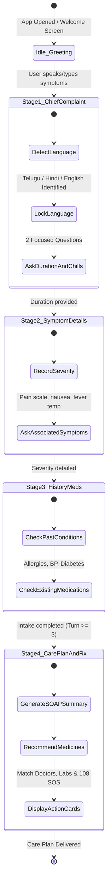
```mermaid
stateDiagram-v2
    [*] --> Idle_Greeting: App Opened / Welcome Screen
    Idle_Greeting --> Stage1_ChiefComplaint: User speaks/types symptoms
    
    state Stage1_ChiefComplaint {
        [*] --> DetectLanguage
        DetectLanguage --> LockLanguage: Telugu / Hindi / English Identified
        LockLanguage --> AskDurationAndChills: 2 Focused Questions
    }

    Stage1_ChiefComplaint --> Stage2_SymptomDetails: Duration provided
    
    state Stage2_SymptomDetails {
        [*] --> RecordSeverity
        RecordSeverity --> AskAssociatedSymptoms: Pain scale, nausea, fever temp
    }

    Stage2_SymptomDetails --> Stage3_HistoryMeds: Severity detailed
    
    state Stage3_HistoryMeds {
        [*] --> CheckPastConditions
        CheckPastConditions --> CheckExistingMedications: Allergies, BP, Diabetes
    }

    Stage3_HistoryMeds --> Stage4_CarePlanAndRx: Intake completed (Turn >= 3)
    
    state Stage4_CarePlanAndRx {
        [*] --> GenerateSOAPSummary
        GenerateSOAPSummary --> RecommendMedicines
        RecommendMedicines --> DisplayActionCards: Match Doctors, Labs & 108 SOS
    }

    Stage4_CarePlanAndRx --> [*]: Care Plan Delivered
```

---

### B. 15-Minute Medicine Order Lifecycle

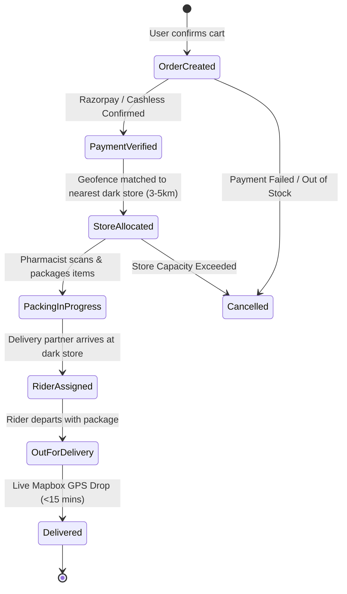
```mermaid
stateDiagram-v2
    [*] --> OrderCreated: User confirms cart
    OrderCreated --> PaymentVerified: Razorpay / Cashless Confirmed
    PaymentVerified --> StoreAllocated: Geofence matched to nearest dark store (3-5km)
    StoreAllocated --> PackingInProgress: Pharmacist scans & packages items
    PackingInProgress --> RiderAssigned: Delivery partner arrives at dark store
    RiderAssigned --> OutForDelivery: Rider departs with package
    OutForDelivery --> Delivered: Live Mapbox GPS Drop (<15 mins)
    Delivered --> [*]

    OrderCreated --> Cancelled: Payment Failed / Out of Stock
    StoreAllocated --> Cancelled: Store Capacity Exceeded
```

---

### C. Video Teleconsultation State Machine

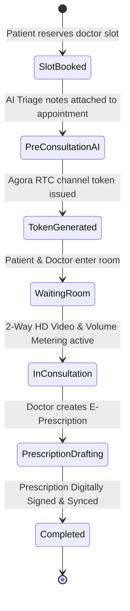
```mermaid
stateDiagram-v2
    [*] --> SlotBooked: Patient reserves doctor slot
    SlotBooked --> PreConsultationAI: AI Triage notes attached to appointment
    PreConsultationAI --> TokenGenerated: Agora RTC channel token issued
    TokenGenerated --> WaitingRoom: Patient & Doctor enter room
    WaitingRoom --> InConsultation: 2-Way HD Video & Volume Metering active
    InConsultation --> PrescriptionDrafting: Doctor creates E-Prescription
    PrescriptionDrafting --> Completed: Prescription Digitally Signed & Synced
    Completed --> [*]
```

---

## 6. Role-Wise Capabilities & Feature Matrix

```
┌────────────────────────────────────────────────────────────────────────┐
│                        HealthExpress AI Roles                          │
├─────────────────┬─────────────────┬──────────────────┬─────────────────┤
│ 👤 Patient      │ 🩺 Doctor       │ 🏥 Hospital      │ 🏬 Store / Super│
│ • Voice AI      │ • Agora Video   │ • Bed Tracking   │ • 15-Min Order  │
│ • 15-Min Drops  │ • Rx Builder    │ • Admissions     │ • KYC Audit     │
│ • Aarogyasri    │ • ABDM QR Scan  │ • Empanelment    │ • API Health    │
└─────────────────┴─────────────────┴──────────────────┴─────────────────┘
```

| Role | Key Capabilities & Functionalities |
| :--- | :--- |
| **👤 Patient** | • Multilingual voice AI clinical intake in Telugu, Hindi, English.<br>• Search and filter doctors by specialty, distance, fee, and rating.<br>• Book in-clinic or instant Agora HD video consultations.<br>• 15-minute emergency medicine delivery with Mapbox live GPS tracking.<br>• Book home diagnostic lab test collection packages (CBC, Lipid, HbA1c, Dengue, Thyroid).<br>• Verify Aarogyasri health pass & generate ABDM 15-minute QR consent tokens.<br>• 1-tap emergency 108 ambulance dispatch and live hospital bed vacancy tracker. |
| **🩺 Doctor** | • Manage appointment queue (in-clinic, video, home visit).<br>• Review pre-consultation AI-generated SOAP notes and triage summaries.<br>• Conduct encrypted HD video/audio teleconsultations.<br>• Build and digitally sign E-Prescriptions with integrated dosage guidelines.<br>• Scan patient ABDM QR codes to securely access past medical histories and allergies.<br>• Configure weekly consultation schedules, slots, and fees. |
| **🏥 Hospital Admin** | • Real-time bed management: General, ICU, and Emergency Trauma beds.<br>• Manage patient admission, discharge, and emergency transfers.<br>• Maintain hospital department rosters and primary vs visiting doctor affiliations.<br>• Process Aarogyasri cashless pre-authorizations and insurance claims. |
| **🏬 Pharmacy Partner**| • Self-onboarding with Drug License, GST verification, and delivery radius (3–5 km).<br>• Live inventory catalog management with batch numbers, pricing, and stock levels.<br>• Receive instant 15-minute emergency order alerts with fast-pack workflow.<br>• Delivery rider dispatch and Mapbox route synchronization. |
| **👑 Super Admin** | • Platform-wide KPI telemetry: Total active users, doctors, hospitals, and revenue ledger.<br>• Pharmacy dark store drug license review and approval/rejection queue.<br>• Doctor Medical Council registration certificate verification.<br>• Real-time API uptime health monitor and MariaDB connectivity diagnostics. |

---

## 7. Production Relational Database Schema & ER Diagram

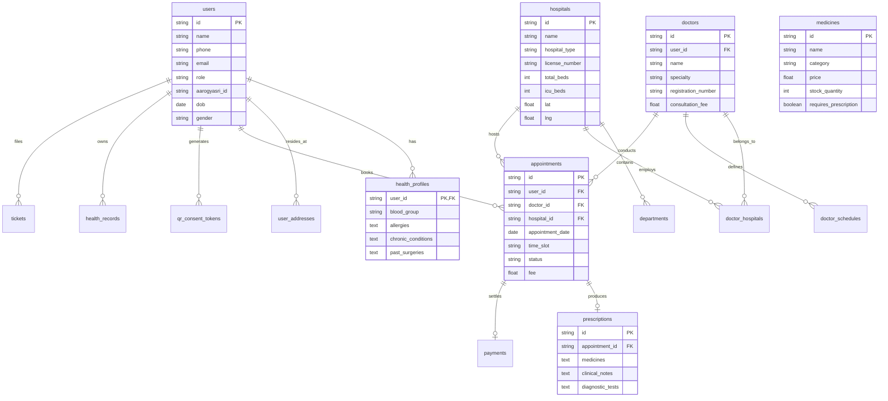
```mermaid
erDiagram
    users ||--o{ health_profiles : has
    users ||--o{ user_addresses : resides_at
    users ||--o{ appointments : books
    users ||--o{ qr_consent_tokens : generates
    users ||--o{ health_records : owns
    users ||--o{ tickets : files
    
    hospitals ||--o{ departments : contains
    hospitals ||--o{ doctor_hospitals : employs
    hospitals ||--o{ appointments : hosts
    
    doctors ||--o{ doctor_hospitals : belongs_to
    doctors ||--o{ doctor_schedules : defines
    doctors ||--o{ appointments : conducts
    
    appointments ||--o| prescriptions : produces
    appointments ||--o| payments : settles
    
    users {
        string id PK
        string name
        string phone
        string email
        string role
        string aarogyasri_id
        date dob
        string gender
    }

    health_profiles {
        string user_id PK,FK
        string blood_group
        text allergies
        text chronic_conditions
        text past_surgeries
    }

    hospitals {
        string id PK
        string name
        string hospital_type
        string license_number
        int total_beds
        int icu_beds
        float lat
        float lng
    }

    doctors {
        string id PK
        string user_id FK
        string name
        string specialty
        string registration_number
        float consultation_fee
    }

    appointments {
        string id PK
        string user_id FK
        string doctor_id FK
        string hospital_id FK
        date appointment_date
        string time_slot
        string status
        float fee
    }

    prescriptions {
        string id PK
        string appointment_id FK
        text medicines
        text clinical_notes
        text diagnostic_tests
    }

    medicines {
        string id PK
        string name
        string category
        float price
        int stock_quantity
        boolean requires_prescription
    }
```

### Authoritative MariaDB Tables (`u170253497_healthexpress`):

| # | Table Name | Key Columns | Purpose |
| :---: | :--- | :--- | :--- |
| **1** | `users` | `id`, `name`, `phone`, `email`, `role`, `aarogyasri_id`, `dob`, `gender` | Primary user identity directory and authentication |
| **2** | `health_profiles` | `user_id`, `blood_group`, `allergies`, `chronic_conditions`, `past_surgeries` | Comprehensive EHR vault and clinical history |
| **3** | `user_addresses` | `id`, `user_id`, `address_line1`, `city`, `state`, `pincode`, `latitude`, `longitude` | Geolocation coordinates for 15-minute delivery routing |
| **4** | `hospitals` | `id`, `name`, `hospital_type`, `license_number`, `total_beds`, `icu_beds`, `lat`, `lng` | Empaneled hospital facility registry and GPS coordinates |
| **5** | `departments` | `id`, `hospital_id`, `name`, `description` | Hospital clinical specialty departments |
| **6** | `doctors` | `id`, `user_id`, `name`, `specialty`, `registration_number`, `consultation_fee` | Doctor medical credentials, fee, and verification status |
| **7** | `doctor_hospitals` | `doctor_id`, `hospital_id`, `department_id`, `affiliation_type` | Multi-facility doctor hospital affiliations |
| **8** | `doctor_schedules` | `doctor_id`, `day_of_week`, `start_time`, `end_time`, `slot_duration_minutes` | Weekly recurring consultation availability slots |
| **9** | `appointments` | `id`, `user_id`, `doctor_id`, `hospital_id`, `appointment_date`, `time_slot`, `fee` | Central appointment lifecycle and video room mapping |
| **10** | `prescriptions` | `id`, `appointment_id`, `medicines`, `clinical_notes`, `diagnostic_tests` | Digital signed E-Prescriptions synced to patient cart |
| **11** | `medicines` | `id`, `name`, `category`, `price`, `stock_quantity`, `requires_prescription` | 15-minute pharmacy catalog & live inventory |
| **12** | `qr_consent_tokens` | `id`, `token`, `user_id`, `expires_at`, `status`, `scanned_by` | ABDM 15-minute dynamic consent tokens |
| **13** | `health_records` | `id`, `user_id`, `record_type`, `title`, `file_url`, `created_at` | Encrypted digital medical document vault |
| **14** | `payments` | `id`, `appointment_id`, `razorpay_order_id`, `amount`, `currency`, `status` | Razorpay Live transactions and revenue ledger |
| **15** | `tickets` | `id`, `user_id`, `category`, `subject`, `description`, `status`, `priority` | 24x7 customer support dispute ticketing system |
| **16** | `chat_messages` | `id`, `sender_id`, `receiver_id`, `message`, `is_read`, `created_at` | 2-way doctor-patient encrypted clinical chat |

---

## 8. Complete REST API Endpoint Directory

All endpoints are hosted live on Hostinger at `https://vedvaidyam.com/healthexpress/api`:

| HTTP Method | Route | Description | Status |
| :--- | :--- | :--- | :---: |
| `GET` | `/health` | Live database connectivity & server status check | `200 OK` |
| `GET` | `/hospitals` | Hospital directory with proximity distance calculation | `200 OK` |
| `GET` | `/doctors` | Registered doctors with specialty & hospital affiliation | `200 OK` |
| `GET` | `/pharmacy/medicines` | 15-minute delivery medicine catalog & stock count | `200 OK` |
| `GET` | `/diagnostic/lab-tests` | Diagnostic lab test packages & fasting criteria | `200 OK` |
| `GET` | `/orders/business-products` | Home medical devices & wellness checkup packages | `200 OK` |
| `GET` | `/aarogyasri/lookup` | Real-time Aarogyasri health pass eligibility lookup | `200 OK` |
| `POST` | `/auth/register` | Quick patient registration & Aarogyasri pass generation | `200 OK` |
| `POST` | `/appointments/book` | Real-time slot booking with subsidy calculation | `200 OK` |
| `GET` | `/appointments/user/:id` | Retrieve patient appointment history & statuses | `200 OK` |
| `PUT` | `/appointments/:id/prescription`| Doctor issues digitally signed E-Prescription | `200 OK` |
| `POST` | `/telehealth/generate-agora-token`| Generates 24-hour Agora RTC WebRTC video token | `200 OK` |
| `POST` | `/consent/generate-token`| Generates 15-minute dynamic ABDM QR consent token | `200 OK` |
| `POST` | `/consent/doctor-scan` | Doctor scans QR to unlock patient clinical vault | `200 OK` |
| `POST` | `/ai/triage` | Persist and score AI clinical symptom intake | `200 OK` |
| `GET` | `/ai/sessions/user/:id` | Historical AI triage sessions & clinical SOAP notes | `200 OK` |
| `POST` | `/payments/create-order` | Create Razorpay Live payment order ID | `200 OK` |
| `POST` | `/payments/verify` | Verify Razorpay payment signature (HMAC-SHA256) | `200 OK` |

---

## 9. Technology Stack & Directory Structure

```
healthyxpress_medha/
├── 3D-ILLUS/                     # 🎨 High-resolution 3D asset source files
│   ├── ADMIN-PANAL/              # 3D illustration metrics (1.png - 8.png)
│   ├── illustratuions/           # High-resolution hero assets (health-ai.png)
│   └── user-home-quickactions/   # Patient dashboard action assets (1.png - 7.png)
│
├── ui/                           # 📸 35 Production screenshots for README & docs
│   ├── admin-panal-tabs (1-8).png# Super Admin workspaces (Beds, Stores, Doctors, Revenue)
│   ├── ai-chat, ai-call, lang.png# Multilingual Voice AI triage & auto-language detection
│   ├── ai-vision, ai-capture.png # Groq AI Vision prescription & symptom detection
│   ├── docters, book, confirm.png# Doctor discovery, slot booking & appointment queue
│   ├── videocall, call, doc-chat # Agora HD video & audio teleconsultations
│   ├── arogyasree, more-info.png # Aarogyasri 5L pass & ABDM digital health locker
│   └── home, nearby, map, etc.   # Patient home, hospital bed tracker & Mapbox GPS map
│
├── healthexpress/                # 📱 Flutter Web & Mobile Super-App
│   ├── lib/
│   │   ├── core/config/          # Live API URLs, Keys (NVIDIA, Sarvam, Agora, Razorpay)
│   │   ├── core/theme/           # Glassmorphism design tokens & Medical Teal palette
│   │   ├── models/               # Hospital, Doctor, Medicine, Appointment, User models
│   │   ├── providers/            # Riverpod & Provider state managers (AI, Auth, Pharmacy)
│   │   ├── services/             # REST client, Agora WebRTC, Sarvam STT, NVIDIA NIM
│   │   └── screens/              # Patient & Doctor multi-role responsive screens
│   └── web/                      # PWA shell, Mapbox GL JS, Web Audio API VAD, CanvasKit
│
├── admin_panel/                  # 💻 React 19 + Vite Super Admin Dashboard
│   ├── src/
│   │   ├── components/           # MetricCard, Modal, Navbar, Sidebar
│   │   ├── views/                # 12 Operational Workspaces (Beds, Stores, Doctors, etc.)
│   │   └── services/             # Axios REST client for live MariaDB telemetry
│   └── package.json
│
├── php_backend/                  # 🐘 Hostinger Production PHP 8.2+ REST API
│   ├── .htaccess                 # Apache mod_rewrite clean routing
│   ├── index.php                 # Front Controller & 16-route REST dispatcher
│   ├── config/                   # PDO database singleton with connection pooling
│   ├── controllers/              # 15 Specialized Controllers (Ai, Auth, Doctor, etc.)
│   └── database/schema.sql       # 16-table relational MariaDB schema
│
└── deploy.ps1                    # 🚀 Automated dual-deployment build & push script
```

---

## 10. Setup, Local Development & Deployment Guide

### A. Flutter Mobile & Web Super-App
```bash
cd healthexpress

# 1. Install Flutter dependencies
flutter pub get

# 2. Run unit & widget tests
flutter test

# 3. Launch Flutter Web locally on Chrome
flutter run -d chrome
```

### B. React 19 Super Admin Dashboard
```bash
cd admin_panel

# 1. Install NPM packages
npm install

# 2. Launch Vite development server (http://localhost:5173)
npm run dev

# 3. Build optimized production bundle
npm run build
```

### C. Automated Dual Deployment (GitHub Pages)
A single PowerShell script builds both Flutter Web and React Admin, then deploys them simultaneously to GitHub Pages:
```powershell
# Run dual deployment
powershell -ExecutionPolicy Bypass -File .\deploy.ps1
```

---

## 11. Compliance & Clinical Standards

* **ABDM (Ayushman Bharat Digital Mission)**: Complete 15-minute tokenized consent architecture with instant QR EHR unlocks.
* **Aarogyasri Health Scheme**: Native lookup and 100% cashless pre-authorization workflows for empaneled procedures.
* **Zero Plain-Text Credentials**: Environment-based configuration, HMAC-SHA256 payment validation, and parameterized SQL queries.
* **DISHA / HIPAA Ready**: Immutable audit trail logging every administrative and clinical data access event.

---

<div align="center">
  <sub>Implemented with ❤️ using <strong><a href="https://bob.ibm.com/">IBM Bob</a></strong>, <strong>Sarvam AI</strong>, and <strong>NVIDIA NIM</strong>.</sub>
</div>
